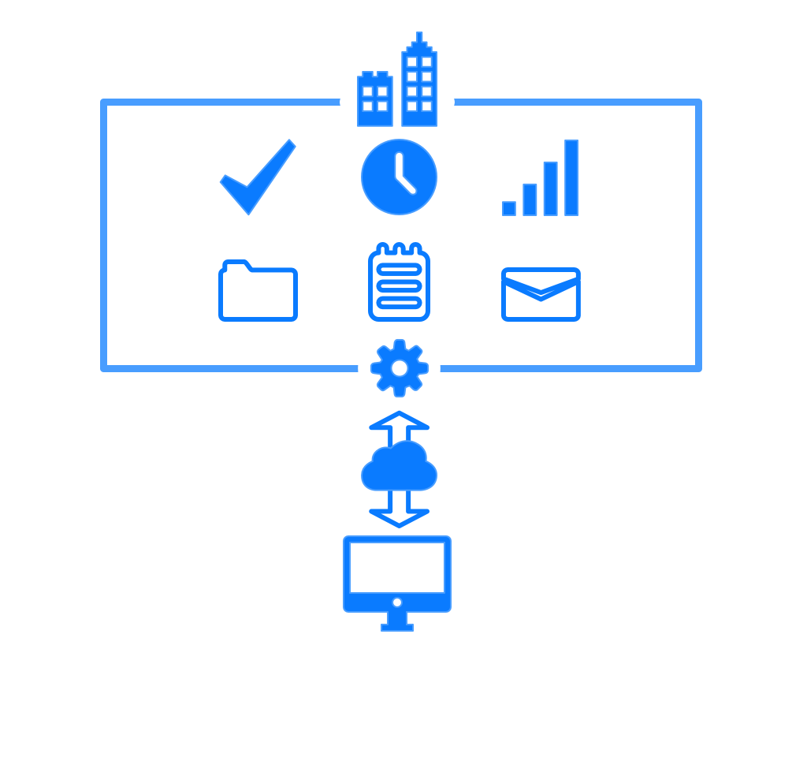

    

    	<h3>Manufacturing Exection (MES) / Manufacturing Operations Management (MOM) Systems</h3>
    

    

    	<h4>Reduce your manufacturing costs <b>30%</b> with the facilities you already have</h4>
    

	

		
You're responsible for improving your bottom line by increasing productivity, reducing downtime, and ultimately increasing revenue.

		
You designed a form to manually collect process data, spend time updating whiteboards with performance data every shift, and battle with Excel to calculate your KPIs. While this information is valuable it caused some friction by requiring your operators to do even more work during their already jam-packed shifts.

		
Now that your system has some traction you are spending time every day putting together reports for corporate and they are looking for even higher performance gains.

		
To get the information you need to go the next level you need to pull together a variety of systems with different data, interfaces, update schedules, and stakeholders.

		
Some of these systems are under your control, while others, like shipping, accounting, or enterprise resource planning (ERP), are in someone else's wheelhouse. The goal of all of these systems is to make someone's life easier, but when it comes to improving your bottom line they could not be more different.

		
Naturally, the more systems there are, the more chaos there is. Your job is to be "the organized one" and make sure everything's under control and things go as planned. You need a clear view of all of your company's moving parts.

		
This is a tall order and a tough job and you rarely get the credit you deserve for doing it well.

		
You crave a system that helps you effortlessly be on top of everything.

		
You need a tool to automatically collect all of your data, while simultaneously turning it into useful information. You need to know what maintenance is doing, how much your raw materials cost, how much energy your facilities are using, automatically calculate and analyze your KPIs, trend data, and generate reports with different information for your operators, your C-level people, and everyone in between.

		
It needs to make things easier for you but it can't be at the expense of anyone else's sanity.

		
You know you can't use tools that impose on the people you're working with. It can't be complicated, it can't force people to drastically change the way they work, and it can't require them to pay close attention all day long so they don't miss something important.

		
You're already fighting an uphill battle against deadlines, expectations, and human nature - you don't want to have to fight against software too.

		
You've worked with people long enough to know some people rally around a new system, others will push hard against it. There will be folks who are all-in, and folks who just want to get stuff sent to them via email. So whatever system you adopt, it needs to work well regardless of how much other people choose to engage with it.

		
This tool needs to be your trusted assistant, not your adversary.

		
In the end, what matters is information, improving the process, and the impact to the bottom line. You need to deliver results, and your people need to be empowered to work smarter. You need tools that'll amplify your skills and support you every step of the way.

		
You're in luck, we build tools like this for people just like you.

	

	

		
		
<b>Manufacturing Execution Systems</b> (<b>MES</b>) or <b>Manufacturing Operations Management</b> systems (<b>MOM)</b> encompass a wide array of intelligent tools enabling you to integrate process data with other business systems including <b>ERP</b> systems giving you a complete view of how all of the moving parts of your operation interact with one another.

	

	

		
Typical MES systems include a handful of common components including:
 
		<ul>
			<li>Operational Equipment Effectiveness</li>
			<li>(OEE) Tracking</li>
			<li>Quality Monitoring</li>
			<li>Recipe Management</li>
			<li>energy Management</li>
			<li>Statistical Process Control</li>
			<li>Scheduling Integration</li>
			<li>Work Order Management</li>
		</ul> 
	

	

		
	

		

		
Each of these tools give you better information about your process and business, providing the insight you need to <b>cut costs</b>, <b>increase productivity</b>, and <b>increase revenue</b>.

		
MES/MOM systems are implemented on top the systems and equipment you are <b>currently using</b>. They can <b>scale</b> as your information needs <b>grow</b>. No matter <b>how many facilities</b> you have, your MES/MOM system allows you to make <b>intelligent decisions</b> about all of them from <b>one interface</b>.

		
MES/MOM systems <b>remove</b> the <b>limitations</b> and <b>hurdles</b> currently standing in the way of reaching your <b>maximum potential</b>.

	

 

	
	

		<h4 style="text-align: left;">Corso Systems MES/MOM Development Philosophy</h4>
		
Our philosophy with MES and MOM systems is to develop easy-to-use systems to give you the information you need to run your company more efficiently. This starts with demonstrating how the system can <b>cut costs</b>, <b>increase productivity</b>, and <b>increase revenue</b>, while developing the <b>business case</b> for <b>capital justification</b>. We then help find the appropriate <b>technology</b> for your needs, based on existing infrastructure, number of facilities, support requirements, etc. We also spend time with corporate <b>stakeholders</b> and <b>IT</b> to find the best ways to integrate the systems with their workflows. After the system is designed and implemented, we provide <b>training</b>, <b>documentation</b>, and <b>support</b> for our customers to get the most value possible from their <b>investment</b>.

	

	

		<h4 >Corso Systems' MES/MOM Engineering Service Offerings and Experience</h4>
	
We can develop <b>new MES/MOM systems</b> from the ground up, and can <b>troubleshoot</b>, <b>update</b>, and <b>modify</b> existing systems anywhere in the world. We are experienced with <b>Siemens</b>, <b>Rockwell</b>, <b>Inductive Automation</b>, <b>Wonderware</b>, and <b>others</b>, including the ability to develop <b>custom systems</b> to meet the needs of <b>any size</b> company.

	
Our MES/MOM systems have helped companies <b>improve equipment utilization</b>, <b>improve operational efficiency and consistency</b>, <b>reduce inventory</b>, <b>reduce scrap and rework</b>, <b>improve response time to production issues</b>, <b>improve visibility to production data</b> within single plant and across world wide manufacturing locations, and provide our customers with <b>common data and reporting tools</b>.

	
	
In addition to implemented MES/MOM systems we develop <b>standardized reports</b>, <b>data visualization tools</b>, <b>APIs</b>, and can implement <b>process-level code</b> to <b>reduce</> the amount of time for <b>MES/MOM system implementation</b>.

    
<h4>Popular MES/MOM System Platforms We Have Worked Implemented</h4>

 

	

<h4 style="text-align: left;">We speclialize in developing customized solutions to meet our clients' needs.</h4>

<h4 style="text-align: left;">If you don't see your platform listed or would like our help with finding a new one, please email one of our engineers at <a href="mailto:info@corsosystems.com?Subject=MES%20Information%20Request">info@corsosystems.com</a>.</h4>

