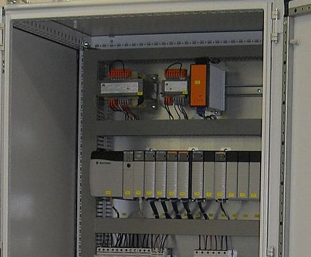

    <h2>PLC Programming</h2>

	

		
A <b>Programmable Logic Controller</b> (PLC) is a specialized industrial computer with physical inputs and outputs used to control <b>industrial processes</b>. PLCs play a large part in the world of <b>industrial automation</b>.

		
PLC programming is typically done in <b>ladder logic</b>, a language designed to mimic the PLC's predecessor, <b>relay logic</b>. Many modern PLCs can be programmed in multiple languages, defined by <b>IEC 61131-3</b> standards, including <b>structured text</b>, <b>function blocks</b>, and <b>sequential flow charts</b>. This gives the PLC the ability to use <b>object oriented</b> code, making it possible to build <b>reusable code</b>, thus <b>saving</b> development <b>time</b> and <b>costs</b>.

	

	

		
	

	
	

		<h4 style="text-align: left;">Corso Systems PLC Development Philosophy</h4>
		
Having spent time deciphering other people's code in the past, we focus on writing <b>structured</b>, <b>well-designed</b> PLC code. The benefit with this approach is an <b>easy</b> to understand, <b>flexible</b> system, capable of modification for <b>future</b> needs. We have <b>libraries</b> of code we have developed and <b>tested</b>, currently running some of the top facilities in the world, available for new systems.

		
Put simply, our goal is to build a system <b>anyone</b> can <b>maintain</b> in the future. Our customers should never feel like we are the only resource available to maintain their systems.

	

	
	

		<h4 >Corso Systems' PLC Engineering Service Offerings and Experience</h4>
	
We can develop <b>new PLC programs</b> from the ground up, and can <b>troubleshoot</b>, <b>update</b>, and <b>modify</b> existing systems anywhere in the world. We are experienced with <b>Siemens</b>, <b>Allen Bradley/Rockwell</b>, <b>Modicon/Schneider Electric</b>, <b>Omron</b>, <b>Automation Direct</b>, <b>SCADAPack</b>, and <b>others</b>, including <b>Safety PLCS</b>. We integrate PLCs with other devices and systems including, but not limited to, <b>HMIs</b>, <b>manufacturing execution systems</b>, <b>databases</b>, <b>drives</b>, and <b>RFID</b> and <b>barcode scanners</b>. We can also work with any industrial network protocol or hardware layer out there, including <b>Profibus</b>, <b>Profinet</b>, <b>ControlNet</b>, <b>DeviceNet</b>, <b>Ethernet I/P</b>, <b>Modbus</b>, <b>RS-232</b>, <b>RS-485</b>, <b>HART</b>, and others.

	
	
In addition to controlling process equipment we <b>develop software libraries</b>, <b>APIs</b>, <b>Add-On Instructions (AOIs)</b> and <b>function blocks</b> enabling end users to easily integrate any other hardware or software you may have into your PLC platform.

    
<h4>PLC Platforms</h4>

 

<h4 style="text-align: left;">We speclialize in developing customized solutions to meet our clients' needs.</h4>

<h4 style="text-align: left;">If you don't see your platform listed or would like our help with finding a new one, please contact us:.</h4>
 <a href="mailto:info@corsosystems.com?Subject=Information%20Request" class="btn btn-cta">Ask us about PLC Programming</a>

