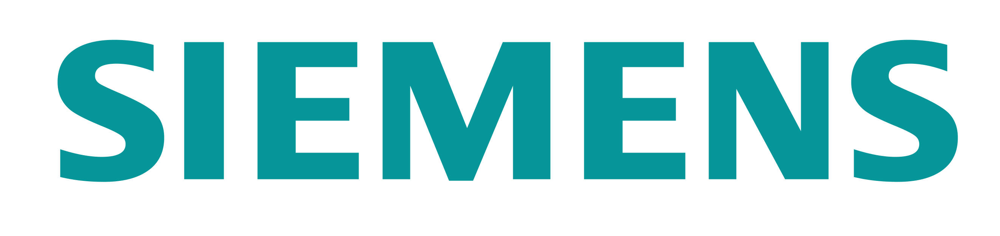

    

    
    

 

	

		
A <b>Programmable Logic Controller</b> (PLC) is a specialized industrial computer with physical inputs and outputs used to control <b>industrial processes</b>. PLCs play a large part in the world of <b>industrial automation</b>.

		
PLC programming is typically done in <b>ladder logic</b>, a language designed to mimic the PLC's predecessor, <b>relay logic</b>. Many modern PLCs can be programmed in multiple languages, defined by <b>IEC 61131-3</b> standards, including <b>structured text</b>, <b>function blocks</b>, and <b>sequential flow charts</b>. This gives the PLC the ability to use <b>object oriented</b> code, making it possible to build <b>reusable code</b>, thus <b>saving</b> development <b>time</b> and <b>costs</b>.

		 
		<h4 style="text-align: left;color:#F64100;">Our Philosophy</h4>
		
Having spent time deciphering other people's code in the past, we focus on writing <b>structured</b>, <b>well-designed</b> PLC code. The benefit with this approach is an <b>easy</b> to understand, <b>flexible</b> system, capable of modification for <b>future</b> needs. We have <b>libraries</b> of code we have developed and <b>tested</b>, currently running some of the top facilities in the world, available for new systems.

		
Put simply, our goal is to build a system <b>anyone</b> can <b>maintain</b> in the future. Our customers should never feel like we are the only resource available to maintain their systems.

		 
		<h4 style="color:#F64100;">Our Service Offerings and Experience</h4>
	
We can develop <b>new PLC programs</b> from the ground up, and can <b>troubleshoot</b>, <b>update</b>, and <b>modify</b> existing systems anywhere in the world. We are experienced with <b>Siemens</b>, <b>Allen Bradley/Rockwell</b>, <b>Modicon/Schneider Electric</b>, <b>Omron</b>, <b>Automation Direct</b>, <b>SCADAPack</b>, and <b>others</b>, including <b>Safety PLCS</b>. We integrate PLCs with other devices and systems including, but not limited to, <b>HMIs</b>, <b>manufacturing execution systems</b>, <b>databases</b>, <b>drives</b>, and <b>RFID</b> and <b>barcode scanners</b>. We can also work with any industrial network protocol or hardware layer out there, including <b>Profibus</b>, <b>Profinet</b>, <b>ControlNet</b>, <b>DeviceNet</b>, <b>Ethernet I/P</b>, <b>Modbus</b>, <b>RS-232</b>, <b>RS-485</b>, <b>HART</b>, and others.

	
In addition to controlling process equipment we <b>develop software libraries</b>, <b>APIs</b>, <b>Add-On Instructions (AOIs)</b> and <b>function blocks</b> enabling end users to easily integrate any other hardware or software you may have into your PLC platform.

	

	

		<label style="color:#F64100;">CONTACT</label><label>&nbsp;CORSO SYSTEMS</label>
		

			
			<label>Need more information?</label>
			 
			<a href="http://www.corsosystems.com/contact" class="btn btn-primary">Contact us</a>
		

		

		

			
			<label>Have a question about a process, technology, or anything else?</label>
			 
			<a href="http://www.corsosystems.com/ask_an_expert.html" class="btn btn-primary">Ask an expert</a>
		

		

		<label style="color:#F64100;">GET</label><label>&nbsp;OUR NEWSLETTER</label>
		<!-- Begin MailChimp Signup Form -->
		<link href="//cdn-images.mailchimp.com/embedcode/slim-081711.css" rel="stylesheet" type="text/css">
		
		

		

			<form action="//corsosystems.us8.list-manage.com/subscribe/post?u=9c3aca2e795f5d04e5358a747&amp;id=f4221f1e3b" method="post" id="mc-embedded-subscribe-form" name="mc-embedded-subscribe-form" class="validate" target="_blank" novalidate>
    				

					
					<input type="email" value="" name="EMAIL" class="email" id="mce-EMAIL" placeholder="email address" required style="width:50%!important;height:34px;border-radius: 3px;">
    			
    					
<input type="text" name="b_9c3aca2e795f5d04e5358a747_f4221f1e3b" tabindex="-1" value="">

    					<input type="submit" value="Subscribe" name="subscribe" id="mc-embedded-subscribe" class="btn btn-primary">
    					
    				

			</form>

		

		&nbsp;
		

		
		

		

			
			
			
			
		

		

		

			<label>Recommended Resources:</label>
			<ul>
				<li><a href="http://www.corsosystems.com/wpsignup">White Papers</a></li>
				<li><a href="http://www.corsosystems.com/case_studies.html">Case Studies</a></li>
				<li><a href="http://www.corsosystems.com/blog.html">Corso Systems Blog</a></li>
				<li><a href="http://www.corsosystems.com/automation_estimator">Automation Project Estimator</a></li>
				<li><a href="http://www.corsosystems.com/mes_estimator">MES Project Estimator</a></li>
			</ul>
		

	

    

 

<h4><b>Please let us know if you have any questions:</b></h4>
 
<a href="mailto:info@corsosystems.com?Subject=Information%20Request" class="btn btn-cta">Ask us about PLCs</a>

 
 
